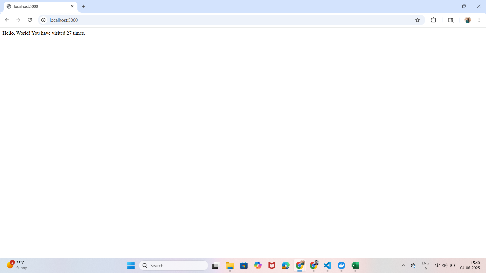

# Dockerized Flask + Redis Counter App

A simple containerized web application that uses **Flask** and **Redis** to count and display the number of visits to a page.

---

## Tech Stack

-  Python 3.9 (Flask Framework)
-  Redis (Key-Value Data Store)
-  Docker & Docker Compose

---

## Project Structure

docker-flask-redis/
├── app/
|    |_ app.py
│     _ requirements.txt
├── Dockerfile
├── docker-compose.yml
├── README.md

---

## How to Run Locally

Make sure [Docker Desktop](https://www.docker.com/products/docker-desktop/) is installed and running.

### Step into the project directory
cd docker-flask-redis

### Build and start the app
docker compose up --build

---

## Screenshot
